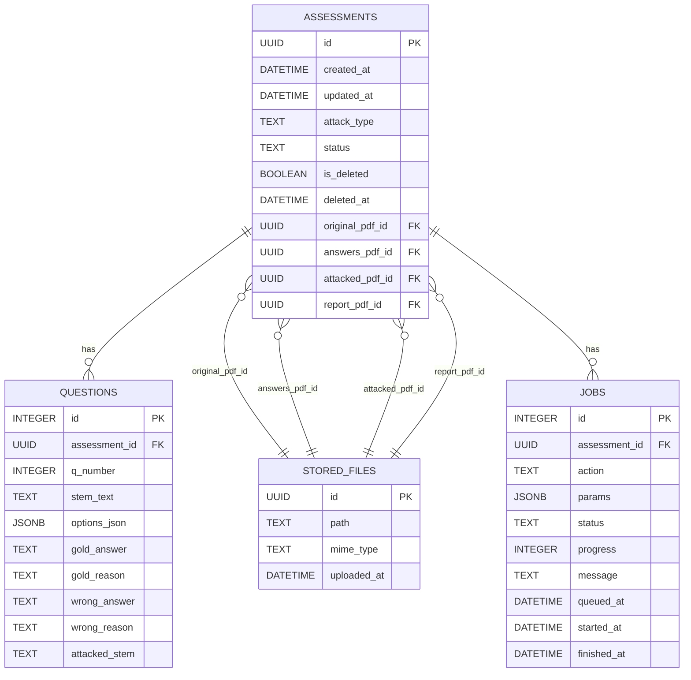

## System Overview

This document explains the high-level architecture, processing pipeline, database schema, and key resources used by the application.

### Architecture
- **Backend**: Flask + SQLAlchemy + Alembic (PostgreSQL)
- **Frontend**: React + TypeScript + Vite
- **PDF Tooling**: PyPDF2, pdfminer.six, LaTeX (XeLaTeX)
- **LLM Evaluation**: OpenAI (optional), Google Drive (Responses API flow)

### Processing Pipeline
1) **Upload**
   - Route: `POST /api/assessments/upload`
   - Saves PDFs under `backend/data/assessments/<uuid>/`
   - Creates a new `Assessment` for every run (no overwrite)
2) **Parse Questions**
   - Default: `pdf_utils.parse_pdf_questions`
   - Optional OCR path when `USE_OCR=1`: `ocr_service`
3) **Apply Attack**
   - `attack_service.apply_attack` based on selected `AttackType`
   - Includes Code Glyph (C+G) attack (requires prebuilt fonts)
4) **Generate Wrong Answers**
   - `wrong_answer_service.generate_wrong_answer`
   - Uses OpenAI when available; falls back to heuristics
5) **Build Attacked PDF + Reference Report**
   - `pdf_utils.build_attacked_pdf`
   - `pdf_utils.build_reference_report`
6) **Evaluate (optional)**
   - If `ENABLE_LLM=1` and attack != NONE
   - `openai_eval_service` (standard and C+G paths), optionally via Google Drive + OpenAI Responses API
7) **Download**
   - `GET /api/assessments/{id}/attacked` and `/report`

### Key API Endpoints
- `POST /api/assessments/upload` — Uploads PDFs, runs pipeline, returns `{ assessment_id }`
- `GET /api/assessments/<id>/attacked` — Download attacked PDF
- `GET /api/assessments/<id>/report` — Download reference report

### Database Schema (ER Diagram)

### Important Modules (Backend)
- `app/__init__.py` — App factory, DB, CORS, blueprints
- `app/routes/assessments.py` — Upload flow, PDF processing, downloads
- `app/services/pdf_utils.py` — Parse questions, LaTeX generation, PDF build
- `app/services/attack_service.py` — Attack logic and `AttackType`
- `app/services/wrong_answer_service.py` — Wrong/distractor generation
- `app/services/openai_eval_service.py` — OpenAI + Google Drive evaluation helpers
- `app/models.py` — SQLAlchemy models for all entities

### Runtime Directories
- `backend/data/assessments/<uuid>/` — All per-run artifacts (original/answers/attacked/report, LaTeX temp)
- `backend/output/` — Debug copies of key outputs
- `backend/data/prebuilt_fonts/` — Prebuilt fonts for C+G attack

### Environment Variables
- `DATABASE_URL` — PostgreSQL connection string
- `OPENAI_API_KEY` — Required for LLM evaluation
- `ENABLE_LLM` — `1` to enable, `0` to disable (dev/testing)
- `USE_OCR` — `1` to prefer OCR extraction pipeline
- `CODE_GLYPH_FONT_MODE` — `prebuilt` recommended
- `CODE_GLYPH_PREBUILT_DIR` — Absolute path to prebuilt font folder

### Operational Notes
- Each upload creates a new `Assessment` (idempotent artifact creation per-run without overwriting previous runs)
- When LLM is disabled, the rest of the pipeline (attack + PDFs + report) still functions
- If XeLaTeX or fonts are missing, PDF generation may fail; verify your TeX and font paths

### Troubleshooting (Quick)
- Migration errors: ensure `flask db upgrade` ran against the correct `DATABASE_URL`
- OpenAI 401: set a valid `OPENAI_API_KEY` or set `ENABLE_LLM=0`
- macOS port 5000 conflict: run backend on `5001` as shown in the setup guide 